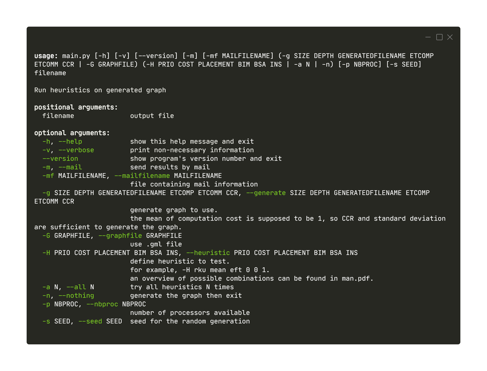

Entry points
=====================

Main script
---------------

The main script is main.py. The usage can be found below :

where the following values are allowed for --heuristic :

:PRIO:
    : 'rku', 'random', 'BIL', 'rkd', 'cluHPS', 'rkusd', 'rkuad'
:COST:
    : 'mean', 'median', 'maxmax', 'minmax', 'minmin', 'maxmin'
:PLACEMENT:
    : 'eft', 'BIM*', 'OLB', 'MET', 'DL', 'GDL'
:DESC:
    : 'DLS/DC', 'DCP', None
:BIM:
    : 0, 1
:BSA:
    : 0, 1
:INSERTION:
    : 0, 1

It is also to be noted that --nbproc should not be higher than the value used when generating the graph.

allScript.py
------------------------

resAggregator.py
-------------------------

